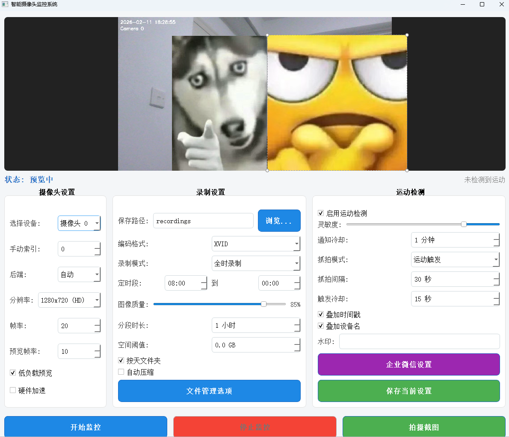

# 电脑摄像头监控系统

本文档介绍程序的全部功能、适用摄像头类型及新手使用方法。无论是做简单的看家看店，还是长期录像留底，都可以参考本说明快速上手。

## 项目预览

---

## 一、程序概览

- 基于 **OpenCV + PyQt5** 的本地摄像头监控工具  
- 支持 **本地视频采集设备** 的高清预览与录制  
- 内置 **运动检测、企业微信图片通知、抓拍、分段录像、自动清理** 等功能  
- 通过图形界面完成全部操作，无需写代码

---

## 二、支持的摄像头类型说明

程序底层使用的是 `cv2.VideoCapture(索引, 后端)` 打开设备，并自动尝试 Windows 下常见的摄像头后端（`DSHOW / MSMF / ANY`）。  
因此，**能否使用，取决于设备是否在系统中被识别为“摄像头 / 视频采集设备”**。

**1. 完全支持的类型**

- 笔记本自带摄像头
- USB 接口的 UVC 标准网络摄像头（绝大部分 USB 摄像头）
- 通过 USB 连接的会议摄像头、文档摄像头等
- 通过采集卡接入的 HDMI/SDI 摄像头，只要采集卡在系统设备管理器中显示为摄像头

只要在 Windows 的「设备管理器」或其他软件（如 QQ 视频、微信视频）中能被选为摄像头，一般本程序都能识别。

---

## 三、界面模块与功能说明

程序主界面从上到下、从左到右分为以下几个区域：

### 1. 画面预览与状态栏

- **摄像头预览区域**：显示当前摄像头画面（预览或监控中）
- **状态标签（左侧）**：显示当前状态  
  - `状态: 未启动` / `预览中` / `监控中` / `运动等待` / `定时等待` / 错误信息等
- **运动状态标签（右侧）**：  
  - `未检测到运动`（灰色）  
  - `检测到运动!`（红色加粗）：当前帧触发了运动检测

### 2. 左侧面板：摄像头设置

- **选择设备**（下拉框）
  - 自动列出系统中可用的摄像头索引（0、1、2…）
  - 若显示“未检测到摄像头”，说明系统没有识别到本地视频设备

- **手动索引**
  - 范围 0–30  
  - 用于手动尝试打开某些未被自动扫描出来的设备（例如特殊采集卡）

- **后端**
  - 可选：`自动 / DSHOW / MSMF / ANY`  
  - 一般保持“自动”即可；如果某个设备在一个后端表现更稳定，可以手动指定

- **分辨率**
  - 选项：`1280x720 (HD)` / `1920x1080 (FHD)` / `640x480 (SD)` / `320x240 (低)`  
  - 选择后会重新启动预览并尝试设置对应分辨率（实际是否成功取决于摄像头能力）

- **帧率**
  - 录制时使用的目标 FPS（1–60）

- **预览帧率**
  - 仅用于预览时的刷新频率，防止预览过高导致 CPU 占用过大

- **低负载预览**
  - 勾选后，预览帧率优先使用较低值，减轻系统负担

- **硬件加速**
  - 尝试启用摄像头硬件加速（取决于驱动支持情况），在某些设备上可以降低 CPU 占用

### 3. 中间面板：录制设置

- **保存路径**
  - 显示当前录像与截图的保存文件夹路径  
  - 点击「浏览…」按钮选择新的保存目录

- **编码格式**
  - 选项：`自动 / XVID / MJPG / H264 / MP4V`  
  - 不同编码对文件大小、兼容性有影响；一般建议：
    - 兼容性优先：`XVID`  
    - 画质+流畅：`MJPG`（文件较大）  
    - 若系统支持可尝试 `H264`

- **录制模式**
  - `全时录制`：监控期间持续录像  
  - `运动录制`：仅在检测到运动时录制  
  - `定时录制`：仅在设定时间段内录制

- **定时段**
  - 仅对「定时录制」模式生效  
  - 通过两个时间控件设置开始时间和结束时间（例如 08:00 到 20:00）

- **图像质量**
  - 1–100，影响压缩质量（配合编码器使用），数值越大画质越好、文件越大

- **分段时长**
  - 单个视频文件的最长时长（以小时计）  
  - 超过后自动开新文件，便于管理与防止单文件过大

- **空间阈值（GB）**
  - 设置最大允许占用空间（例如 50 GB）  
  - 到达阈值后会按时间从旧到新自动删除视频文件，以保证磁盘不会被占满

- **按天文件夹**
  - 勾选：录像按日期自动分到不同子文件夹中（如 `2026-02-11`）

- **自动压缩**
  - 勾选后，在完成录制分段后尝试对视频进行压缩（具体效果视系统环境而定）

- **文件管理选项**
  - 打开文件管理对话框，可配置：
    - 文件保留天数
    - 自动清理日期
    - 其他与历史录像清理相关的参数  
  - 程序会定期检查并清理超过保留天数的旧文件

### 4. 右侧面板：运动检测与通知

- **启用运动检测**
  - 勾选后才会执行运动检测与相关逻辑（运动录制、运动抓拍、通知等）

- **灵敏度**
  - 滑条控制，数值越小表示更敏感（小动作就会触发），数值越大表示只对大运动反应

- **通知冷却**
  - 单位：分钟  
  - 运动检测触发企业微信通知后，会进入冷却时间，在冷却未结束前不会再次发送通知，避免刷屏

- **抓拍模式**
  - `关闭`：不抓拍图片  
  - `按键抓拍`：只在点击「拍摄截图」按钮时保存图片  
  - `运动触发`：检测到运动时自动抓拍  
  - `定时抓拍`：按一定时间间隔自动抓拍当前画面

- **抓拍间隔**
  - 仅「定时抓拍」模式使用，单位为秒（例如 60 秒一张）

- **触发冷却**
  - 仅「运动触发」抓拍模式使用，控制连续抓拍之间的最小间隔秒数

- **叠加时间戳 / 叠加设备名**
  - 勾选后，在画面与录像上叠加当前时间与设备名称水印

- **水印**
  - 自定义文本水印（例如店铺名字、机位编号）

- **企业微信设置**
  - 打开企业微信 Webhook 设置对话框，用于配置报警通知

- **保存当前设置**
  - 将当前所有参数保存到本地配置文件，下次启动自动恢复，无需重新设置

### 5. 底部按钮区

- **开始监控**
  - 打开摄像头并进入监控/录制状态  
  - 根据「录制模式」「运动检测」「抓拍模式」综合决定录像和通知行为

- **停止监控**
  - 结束当前监控和录制，关闭摄像头并释放资源

- **拍摄截图**
  - 手动保存当前画面为高清图片（文件保存在保存路径中）  
  - 按钮只有在预览或监控状态下才可用

---

## 四、新手快速上手指南

### 1. 基础准备

1. 将 USB 摄像头插入电脑，等待系统自动安装驱动。  
2. 确认摄像头在其他软件中能正常使用（如系统相机应用）。  
3. 运行打包好的 `camera_monitor.exe`（或用 Python 运行对应 `.py`）。

### 2. 首次配置推荐步骤

1. **选择设备**
   - 在左侧「摄像头设置」选择正确的摄像头（一般为“摄像头 0”）。
   - 若无画面，可尝试调整「手动索引」为 1、2…。

2. **设置分辨率和帧率**
   - 分辨率建议先用 `1280x720 (HD)`，兼顾清晰与性能。  
   - 录制帧率可设为 15–25；预览帧率 10–15 即可。

3. **设置保存路径**
   - 在中间「录制设置」中点击「浏览…」，选择一个磁盘空间充足的目录。

4. **选择录制模式**
   - 想持续录像：选 `全时录制`。  
   - 想节省空间，只记录有人的画面：选 `运动录制`。  
   - 想只在营业时间录像：选 `定时录制` 并设置时间段。

5. **配置运动检测和通知（可选）**
   - 勾选「启用运动检测」。  
   - 根据场景调整「灵敏度」：  
     - 室外/画面变化多：调高阈值，减少误报。  
     - 室内/画面稳定：可以适当调低。  
   - 设置「通知冷却」：如 5 分钟，避免频繁提醒。

6. **配置企业微信通知（可选）**
   - 在企业微信中创建群机器人，复制其 Webhook URL。  
   - 点击右侧的「企业微信设置」按钮，在弹出窗口中：
     - 粘贴 Webhook 地址  
     - 点击“测试连接”，成功后会在群里收到一条测试消息  
   - 注意：**只有在“开始监控”状态下且检测到运动，才会真正发送通知**，预览模式不会发送。

7. **保存配置**
   - 点击「保存当前设置」，下次启动自动恢复上述所有配置。

8. **开始监控**
   - 最后点击底部「开始监控」，状态栏变为 `监控中 / 运动等待 / 定时等待` 即表示生效。

### 3. 查看录像与截图

- 所有录像文件和抓拍图片都会保存在设置的「保存路径」下：  
  - 若开启「按天文件夹」，会按日期分目录存放。  
  - 文件名包含日期时间，便于查找。

---

## 五、通知与抓拍行为说明

### 1. 运动检测触发通知

- 必须同时满足以下条件才会发送企业微信通知：
  - 已点击「开始监控」，处于录制/监控状态  
  - 勾选了「启用运动检测」  
  - 当前帧检测到运动且超过冷却时间  
- 程序会：
  - 先保存一张高清截图  
  - 然后通过企业微信 Webhook 发送图片消息  
  - 控制台打印“通知已发送 - 时间戳”，状态栏显示“已发送通知”

### 2. 预览模式下的行为

- 点击「开始监控」前的预览状态仅用于调整画面与参数：  
  - 会进行运动检测并在界面上显示“检测到运动! / 未检测到运动”  
  - **不会发送企业微信通知**  
  - **不会根据运动自动录制或抓拍**（除非显式点“拍摄截图”）

### 3. 抓拍模式

- **按键抓拍**：只有点击「拍摄截图」按钮时才保存一张图片。  
- **运动触发**：检测到运动时，在满足「触发冷却」条件下自动保存图片。  
- **定时抓拍**：按设定的间隔（秒）定期保存当前画面，与是否有运动无关。

---

## 六、常见问题与建议

1. **预览没有画面 / 设备无法打开**
   - 检查摄像头是否被其他软件占用（关闭它们）。  
   - 在「选择设备」「手动索引」中尝试不同索引。  
   - 更换「后端」为 `DSHOW` 或 `MSMF` 再试。  
   - 确认摄像头在 Windows 中能正常使用。

2. **通知提示“已发送”，但企业微信收不到**
   - 程序已对企业微信返回的 `errcode` 做校验，若在界面状态栏显示为“通知发送失败/异常”，请：
     - 检查 Webhook 是否正确  
     - 确认机器人仍在群里且未被禁用  
     - 检查企业微信是否对图片消息做了限制

3. **磁盘被录像塞满**
   - 建议：
     - 设置合理的「空间阈值」和「文件保留天数」  
     - 勾选「按天文件夹」便于手动整理  
     - 视情况启用「运动录制」或降低分辨率/帧率

4. **CPU 占用较高**
   - 减小分辨率和帧率；  
   - 勾选「低负载预览」；  
   - 在支持的环境下开启「硬件加速」。

---

## 七、总结

本程序定位为 **本地摄像头/采集卡的智能监控与录像工具**，特点是：

- 上手简单：所有功能通过界面可视化配置  
- 功能全面：运动检测、录制模式、抓拍、企业微信通知、自动清理一应俱全  
- 适用场景广泛：小型店铺看护、办公区简单安防、个人工作室监控等

