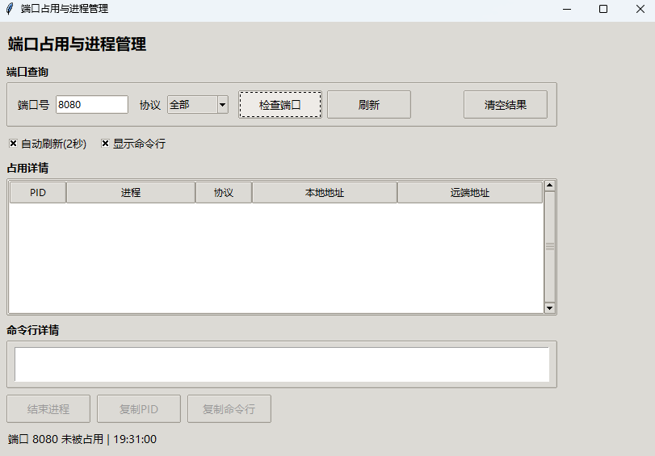

# 端口占用与进程管理小工具

一个基于 Tkinter + psutil 的 Windows 图形界面小工具，用于查询端口占用情况并结束对应进程。

---

## 项目预览



---

## 一、运行环境

- Windows 10/11
- Python 3.10+

---

## 二、源码运行

在项目目录中执行：

```bash
python "一款查看端口占用的小工具.py"
```

---

## 三、打包方法（已使用）

在项目目录中执行：

```bash
python -m PyInstaller --noconsole --onefile "一款查看端口占用的小工具.py"
```

打包完成后生成：

- `dist\一款查看端口占用的小工具.exe`

---

## 四、使用说明

1. 输入端口号并选择协议后点击“检查端口”。  
2. 列表将显示占用该端口的进程信息与地址。  
3. 选中记录可查看命令行详情并复制。  
4. 可选择结束选中进程或结束全部占用进程。  

---

## 五、注意事项

- 结束进程可能需要管理员权限。  
- 部分系统进程不允许访问命令行参数。  
