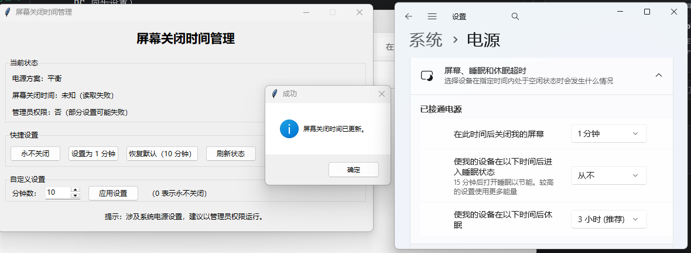

# 电脑定时关屏幕小工具

一个基于 Tkinter 的 Windows 图形界面小工具，用于查看并设置当前电源方案的屏幕关闭时间（AC/DC 同步设置）。

## 项目预览



---

## 一、运行环境

- Windows 10/11
- Python 3.10+

---

## 二、源码运行

在项目目录中执行：

```bash
python "一款电脑定时关屏幕小工具.py"
```

---

## 三、打包方法（已使用）

在项目目录中执行：

```bash
python -m PyInstaller --noconsole --onefile "一款电脑定时关屏幕小工具.py"
```

打包完成后生成：

- `dist\一款电脑定时关屏幕小工具.exe`

---

## 四、使用说明

1. 运行程序后可查看当前电源方案与屏幕关闭时间。  
2. 可使用快捷按钮设置“永不关闭 / 1 分钟 / 恢复默认 10 分钟”。  
3. 也可在“自定义设置”中输入分钟数并应用。  

---

## 五、注意事项

- 修改系统电源策略建议以管理员权限运行。  
- 若电源方案被系统策略限制，设置可能失败。  
