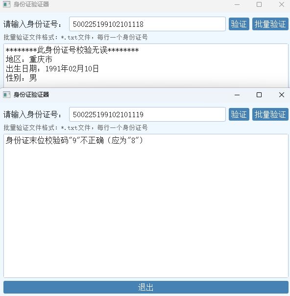

# 身份证规则校验小工具

一个基于 **PyQt6** 的图形界面小工具，用于校验中国大陆二代身份证号码：校验位是否正确、生日是否合法、地区代码是否存在，并支持文本文件批量验证。

---

## 项目预览



## 一、运行环境

- 操作系统：Windows 10 / 11
- Python：3.10+
- 依赖库：
  - PyQt6

安装依赖示例：

```bash
pip install PyQt6
```

---

## 二、源码运行

在项目目录中执行：

```bash
cd 005一款身份证规则校验小工具
python "一款身份证规则校验小工具.py"
```

---

## 三、打包方法（已使用）

使用 PyInstaller 进行打包：

```bash
cd 005一款身份证规则校验小工具
python -m PyInstaller --noconsole --onefile "一款身份证规则校验小工具.py"
```

打包成功后，会生成：

- `dist\一款身份证规则校验小工具.exe`

普通用户可直接双击该可执行文件使用，无需安装 Python。

---

## 四、功能说明

### 1. 单个身份证验证

- 在输入框中输入 18 位身份证号码（支持末位 X/x）。
- 支持回车键快速触发验证。
- 程序会校验：
  - 长度是否为 18 位
  - 前 17 位是否为数字
  - 出生年份在合理范围内
  - 出生日期不晚于当前日期且格式合法
  - 校验位是否正确
- 验证通过时会显示：
  - 地区（根据前两位行政区划代码）
  - 出生日期（格式化为 年-月-日）
  - 性别（根据倒数第二位奇偶判断）

### 2. 批量验证

- 点击“批量验证”按钮，从文件选择对话框中选取一个 `.txt` 文件。
- 文件格式：
  - 每行一个身份证号
  - 自动忽略空行
- 程序会逐行输出每个号码的验证结果，并以分隔线区分。
- 若文件中没有任何有效的非空行，会给出提示信息。

---

## 五、注意事项

- 本工具仅做规则校验，并不访问任何公安或权威数据库，不能作为身份证真伪鉴定依据。
- 地区代码仅按前两位省级行政区划进行识别，部分历史或特殊地区可能显示为“未知地区”。
- 批量处理大文件时，请耐心等待界面输出完成。  
